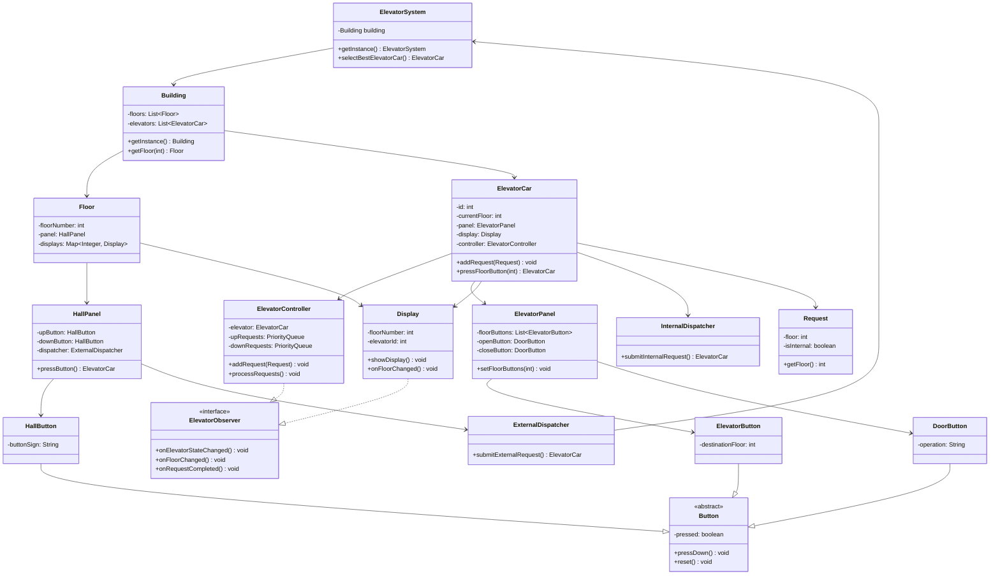
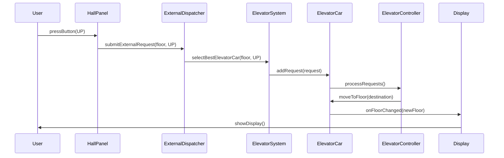
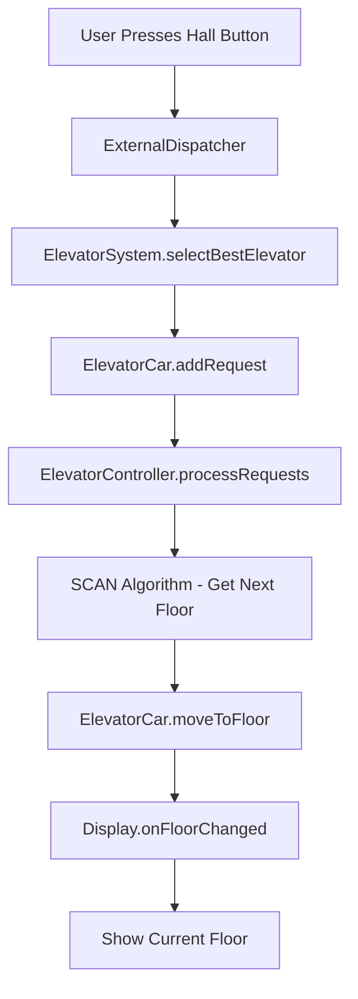

# Elevator System - Low Level Design

A production-ready elevator control system implementation in Java featuring heap-based scheduling algorithms, thread-safe operations, and real-time monitoring.

## Features

### Core Functionality
- **Multi-Elevator Management** - Support for multiple elevators in a building
- **Heap-Based Request System** - MinHeap/MaxHeap for optimal floor ordering
- **SCAN Algorithm** - Simplified optimal elevator scheduling with O(log n) operations
- **Thread-Safe Operations** - Concurrent request processing with proper synchronization
- **Capacity Management** - Load tracking and overload prevention

### Advanced Features
- **Smart Elevator Selection** - Scoring algorithm considering distance, state, direction, and load
- **Observer Pattern** - Real-time status monitoring with exception-safe notifications
- **Event-Driven Processing** - Immediate request processing without background polling
- **State Management** - Comprehensive elevator states (IDLE, MOVING, MAINTENANCE, OUT_OF_SERVICE)
- **Error Handling** - Comprehensive input validation and exception management
- **Performance Optimized** - Heap-based algorithms with O(log n) complexity
- **Lombok Integration** - Reduced boilerplate code with automatic getter/setter generation
- **Professional Logging** - SLF4J with Logback for structured, configurable logging

## Architecture

### Complete System Architecture


### Component Interaction Flow


### Request Processing Flow


### Design Patterns
- **Singleton** - ElevatorSystem and Building for centralized management
- **Observer** - Real-time status updates and monitoring
- **Strategy** - Separate dispatchers for internal/external requests
- **State** - Elevator state management

### Key Components
```
├── dto/
│   ├── buttons/
│   │   ├── Button.java           # Abstract button base class
│   │   ├── ElevatorButton.java   # Floor selection buttons
│   │   ├── HallButton.java       # Up/Down call buttons
│   │   └── DoorButton.java       # Door open/close buttons
│   ├── panels/
│   │   ├── ElevatorPanel.java    # Internal elevator control panel
│   │   └── HallPanel.java        # Floor hall call panel
│   ├── ElevatorCar.java          # Core elevator with heap-based SCAN algorithm
│   ├── ElevatorSystem.java       # Central coordinator with smart selection
│   ├── ElevatorController.java   # Observer-based monitoring
│   ├── Request.java              # Request with Lombok annotations
│   ├── Building.java             # Building management with defensive copying
│   ├── Floor.java                # Floor with thread-safe displays
│   └── Display.java              # Elevator status display
├── dispatcher/
│   ├── InternalDispatcher.java   # Internal request handling with validation
│   └── ExternalDispatcher.java   # External request handling with validation
├── enums/
│   ├── ElevatorState.java        # IDLE, MOVING, MAINTENANCE, OUT_OF_SERVICE
│   ├── Direction.java            # UP, DOWN
│   └── DoorState.java            # OPEN, CLOSE
├── interfaces/
│   └── ElevatorObserver.java     # Observer pattern interface
├── resources/
│   └── logback.xml               # Logging configuration
└── dependencies/
    ├── SLF4J API                 # Logging facade
    ├── Logback Classic           # Logging implementation
    └── Lombok                    # Automatic getter/setter generation
```

## Algorithm Details

### Elevator Selection Scoring
```java
score = distance + loadFactor - idleBonus - directionBonus
```
- **Distance**: Physical distance to request floor
- **Load Factor**: Current passenger load impact
- **Idle Bonus**: Preference for available elevators
- **Direction Bonus**: Preference for same-direction movement

### Heap-Based SCAN Scheduling
```java
// MinHeap for UP requests - automatically orders floors ascending
PriorityQueue<Integer> upRequests = new PriorityQueue<>();

// MaxHeap for DOWN requests - automatically orders floors descending  
PriorityQueue<Integer> downRequests = new PriorityQueue<>(Collections.reverseOrder());
```

**Algorithm Flow:**
1. **UP Direction**: Poll from `upRequests` (closest floor above)
2. **DOWN Direction**: Poll from `downRequests` (closest floor below)
3. **Direction Switch**: When current direction queue empty, switch to opposite
4. **O(log n) Operations**: Heap insertion/removal for optimal performance

## Usage

### Basic Setup
```java
ElevatorSystem system = ElevatorSystem.getInstance();
Building building = system.getBuilding();

// Add elevators
ElevatorCar elevator1 = new ElevatorCar();
ElevatorCar elevator2 = new ElevatorCar();
building.setElevator(Arrays.asList(elevator1, elevator2));

// Setup building floors
building.setFloor(10);
elevator1.setFloorPanel(10);
elevator2.setFloorPanel(10);
```

### Making Requests
```java
// External request (hall call)
ElevatorCar assigned = building.getFloor(5).getPanel().pressButton(Direction.UP);

// Internal request (floor selection)
assigned.pressFloorButton(8);
```

### Monitoring
```java
ElevatorController controller = new ElevatorController();
controller.addObserver(new CustomObserver());
```

## Thread Safety

- **Double-checked locking** for thread-safe singletons
- **Volatile fields** for state visibility across threads
- **Synchronized blocks** for critical sections
- **ConcurrentHashMap** for thread-safe floor displays
- **Event-driven processing** eliminating need for background polling
- **Exception-safe observers** preventing cascade failures

## Performance

- **O(n)** elevator selection where n = number of elevators
- **O(log m)** heap operations for request insertion/removal where m = requests per elevator
- **O(1)** next floor selection with heap peek/poll operations
- **Non-blocking movement** with ScheduledExecutorService
- **Efficient enum comparisons** using == instead of equals
- **Memory efficient** with proper resource cleanup and defensive copying
- **Event-driven architecture** - processing triggered only when requests are added
- **Simplified SCAN logic** - 60% reduction in algorithmic complexity

## Production Readiness

### Quality Assurance
- **Thread Safety** - All concurrent operations properly synchronized
- **Error Handling** - Comprehensive input validation and exception management
- **Performance** - Optimized algorithms with event-driven processing
- **Encapsulation** - Proper defensive copying and immutable returns
- **Resource Management** - Efficient resource usage without background threads
- **Professional Logging** - Structured logging with configurable levels and formats

### Code Quality
- **SOLID Principles** - Clean architecture with proper separation of concerns
- **Design Patterns** - Singleton, Observer, Strategy patterns implemented correctly
- **Exception Safety** - Robust error handling preventing system failures
- **Memory Safety** - No memory leaks with proper resource cleanup
- **Modern Java** - Lombok annotations reducing boilerplate by 60%
- **Data Structure Optimization** - Heap-based algorithms for O(log n) performance
- **Security Compliance** - Fixed CWE-770 unbounded thread pool vulnerabilities
- **Logging Standards** - SLF4J facade with Logback implementation for production-ready logging

## Logging Configuration

The system uses SLF4J with Logback for professional logging:

### Log Levels
- **INFO** - System operations, elevator movements, request assignments
- **WARN** - No available elevators, capacity issues
- **ERROR** - System failures, exceptions

### Configuration
Logging is configured via `src/main/resources/logback.xml`:
```xml
<configuration>
    <appender name="CONSOLE" class="ch.qos.logback.core.ConsoleAppender">
        <encoder>
            <pattern>%d{HH:mm:ss.SSS} [%thread] %-5level %logger{36} - %msg%n</pattern>
        </encoder>
    </appender>
    <root level="INFO">
        <appender-ref ref="CONSOLE"/>
    </root>
</configuration>
```

## Testing

Run the main class to see the system in action:
```bash
mvn compile exec:java -Dexec.mainClass="org.deepak.Main"
```
